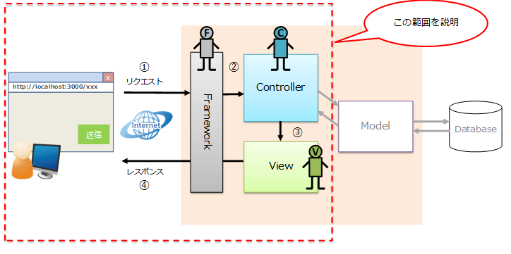
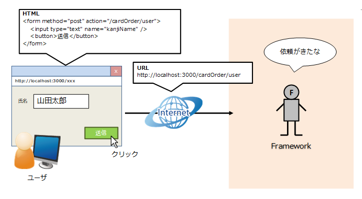
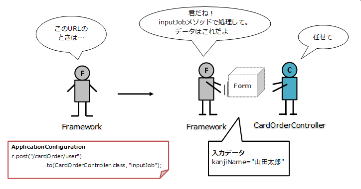
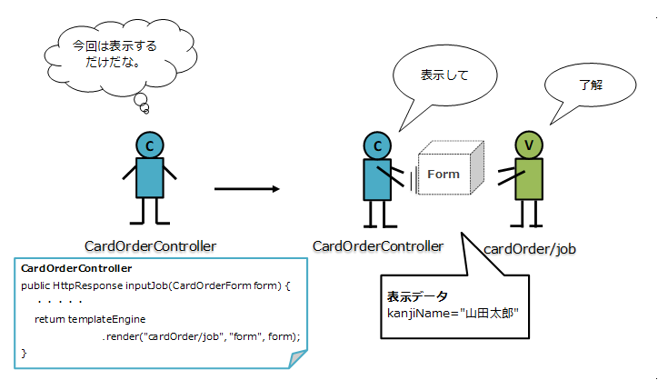
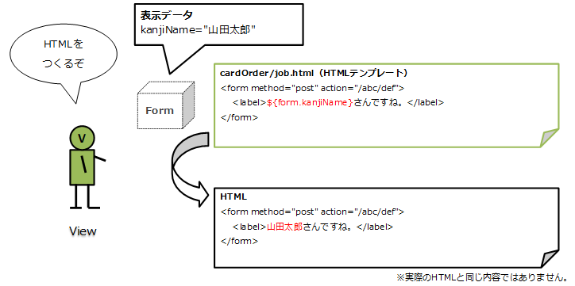
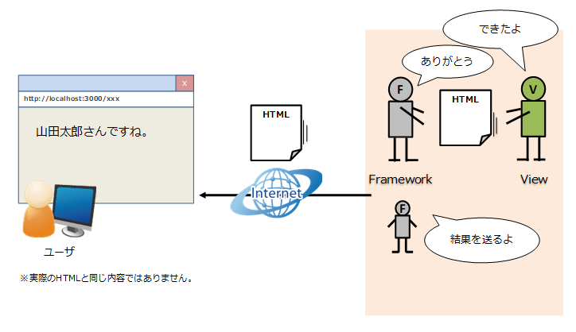
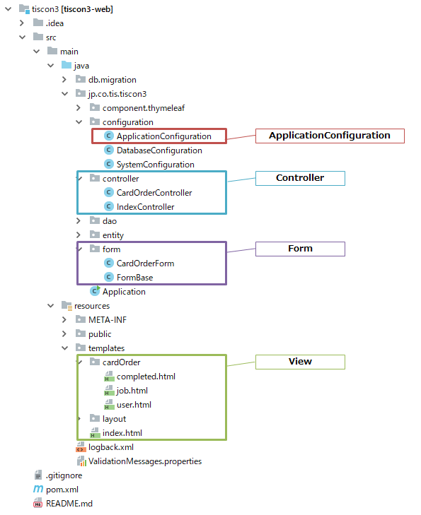

# Webアプリケーションの概要

## 全体像
以下はWebアプリケーションの概念図です。 
ソースコードを参照するにあたって、各プログラムの役割を知っておきましょう。 

## Webアプリケーションの処理フロー
シンプルな例として、赤点線内で完結する処理の流れを追ってみましょう。 

### ① リクエスト
ボタンのクリックなど、Webブラウザを操作することでサーバへ要求が送られます。 
この要求をリクエストと呼びます。 

### ② Controllerの呼び出し
Frameworkはルールに従って、そのリクエストを処理するControllerを呼び出します。 
どのControllerを呼び出すかはApplicationConfigurationを参照します。 

### ③ Viewを呼び出し、HTMLを作る
ControllerはModelやViewなどの必要な処理の呼び出しを制御します。 
今回は画面表示を担うViewのみを呼び出しています。（必要があれば、Viewを呼ぶ前にModelを呼び出します。） 

ViewはHTMLを作成します。 
画面はユーザ操作によって内容が変わるのが普通なので、受け取った値を踏まえてHTMLを作成します。  

### ④ レスポンス
HTMLができたらFrameworkが受け取り、ユーザへ結果を返します。 

ここまでが一連の流れです。

## プログラム構成
環境構築で動作確認の手順まで終えると、以下のようなプログラム構成が確認できます。 
これまでの説明と照らし合わせて、それぞれの役割と呼び出される流れを確認してみましょう。  

